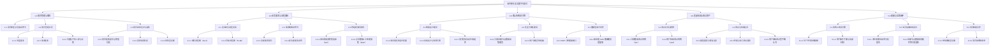

```mermaid
flowchart TD
    Root["海外整车发运数字化项目"]

    Root --> P1["1.0 项目管理与控制"]
    Root --> P2["2.0 业务需求与流程重构"]
    Root --> P3["3.0 核心系统交付物"]
    Root --> P4["4.0 质量验证与测试资产"]
    Root --> P5["5.0 部署与运营闭环"]

    %% 1.0 项目管理与控制
    P1 --> P1_1["1.1 项目章程与范围说明书"]
    P1 --> P1_2["1.2 项目管理计划"]
    P1 --> P1_3["1.3 项目监控记录与报告"]

    P1_2 --> P1_2_1["1.2.1 进度基准"]
    P1_2 --> P1_2_2["1.2.2 成本基准"]
    P1_2 --> P1_2_3["1.2.3 沟通与干系人参与计划"]

    P1_3 --> P1_3_1["1.3.1 项目绩效报告与挣值分析"]
    P1_3 --> P1_3_2["1.3.2 变更请求日志"]
    P1_3 --> P1_3_3["1.3.3 风险登记册"]

    %% 2.0 业务需求与流程重构
    P2 --> P2_1["2.1 发运业务流程文档"]
    P2 --> P2_2["2.2 需求规格说明书"]
    P2 --> P2_3["2.3 跨组织协同规则"]

    P2_1 --> P2_1_1["2.1.1 现状流程图（As-Is）"]
    P2_1 --> P2_1_2["2.1.2 目标流程图（To-Be）"]

    P2_2 --> P2_2_1["2.2.1 功能需求矩阵"]
    P2_2 --> P2_2_2["2.2.2 非功能需求说明"]

    P2_3 --> P2_3_1["2.3.1 承运商绩效考核指标（KPI）"]
    P2_3 --> P2_3_2["2.3.2 异常数据人工处理规程（SOP）"]

    %% 3.0 核心系统交付物
    P3 --> P3_1["3.1 智能比价模块"]
    P3 --> P3_2["3.2 在途可视化模块"]
    P3 --> P3_3["3.3 数据集成中间件"]

    P3_1 --> P3_1_1["3.1.1 承运商在线报价页面"]
    P3_1 --> P3_1_2["3.1.2 自动比价与排序引擎"]
    P3_1 --> P3_1_3["3.1.3 电子定标协议生成组件"]

    P3_2 --> P3_2_1["3.2.1 关键运输节点数据采集服务"]
    P3_2 --> P3_2_2["3.2.2 客户自助查单看板"]

    P3_3 --> P3_3_1["3.3.1 ERP 订单数据接口"]
    P3_3 --> P3_3_2["3.3.2 承运商 TMS 数据映射适配器"]

    %% 4.0 质量验证与测试资产
    P4 --> P4_1["4.1 测试计划与用例"]
    P4 --> P4_2["4.2 测试与验收记录"]

    P4_1 --> P4_1_1["4.1.1 系统集成测试用例（SIT）"]
    P4_1 --> P4_1_2["4.1.2 用户验收测试用例（UAT）"]

    P4_2 --> P4_2_1["4.2.1 缺陷跟踪与修复记录"]
    P4_2 --> P4_2_2["4.2.2 性能与压力测试报告"]
    P4_2 --> P4_2_3["4.2.3 用户验收测试签字确认书"]

    %% 5.0 部署与运营闭环
    P5 --> P5_1["5.1 系统上线交付物"]
    P5 --> P5_2["5.2 业务指标验收报告"]
    P5 --> P5_3["5.3 项目收尾文件"]

    P5_1 --> P5_1_1["5.1.1 生产环境系统镜像"]
    P5_1 --> P5_1_2["5.1.2 用户操作手册与培训材料"]

    P5_2 --> P5_2_1["5.2.1 询价周期达标率分析报告"]
    P5_2 --> P5_2_2["5.2.2 运输节点数据回传及时率分析报告"]

    P5_3 --> P5_3_1["5.3.1 经验教训登记册"]
    P5_3 --> P5_3_2["5.3.2 项目最终验收单"]
```
