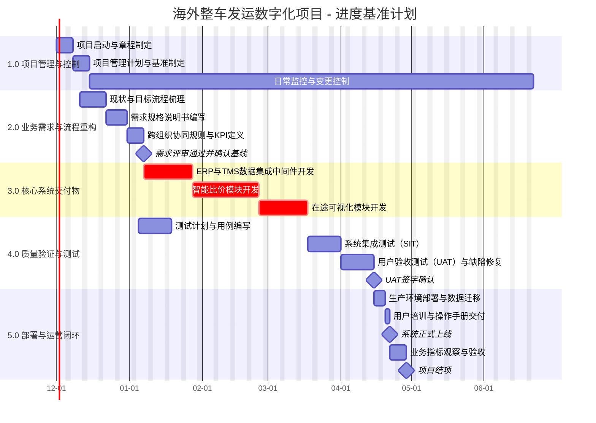

```mermaid
gantt
    title 海外整车发运数字化项目 - 进度基准计划
    dateFormat YYYY-MM-DD
    axisFormat %m-%d
    excludes weekends

    section 1.0 项目管理与控制
    项目启动与章程制定           :p1_1, 2026-12-01, 5d
    项目管理计划与基准制定       :p1_2, after p1_1, 5d
    日常监控与变更控制           :p1_3, after p1_2, until m3

    section 2.0 业务需求与流程重构
    现状与目标流程梳理           :req1, 2026-12-11, 7d
    需求规格说明书编写           :req2, after req1, 7d
    跨组织协同规则与KPI定义      :req3, after req2, 5d
    需求评审通过并确认基线       :milestone, m1, after req3, 0d

    section 3.0 核心系统交付物
    ERP与TMS数据集成中间件开发   :crit, dev1, after m1, 15d
    智能比价模块开发             :crit, dev2, after dev1, 20d
    在途可视化模块开发           :crit, dev3, after dev2, 15d

    section 4.0 质量验证与测试
    测试计划与用例编写           :test1, 2027-01-05, 10d
    系统集成测试（SIT）          :test2, after dev3 test1, 10d
    用户验收测试（UAT）与缺陷修复 :test3, after test2, 10d
    UAT签字确认                  :milestone, m2, after test3, 0d

    section 5.0 部署与运营闭环
    生产环境部署与数据迁移       :dep1, after m2, 3d
    用户培训与操作手册交付       :dep2, after dep1, 2d
    系统正式上线                 :milestone, live, after dep2, 0d
    业务指标观察与验收           :dep3, after live, 5d
    项目结项                     :milestone, m3, after dep3, 0d
```
