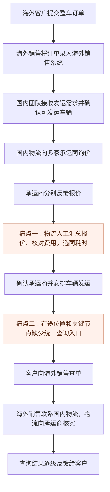
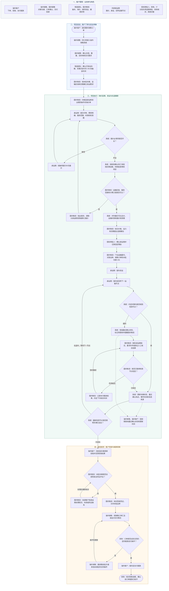

# 海外整车发运业务流程与责任分工

海外销售收到客户订单后，将订单录入海外销售系统，由国内团队组织车辆发运至客户指定目的地。本项目聚焦两个环节：发运前的承运商比价，以及发运后的在途跟踪。

## 一、现状流程（As-Is）

```mermaid
flowchart TD
    A["海外客户提交整车订单"] --> B["海外销售将订单录入海外销售系统"]
    B --> C["国内团队接收发运需求并确认可发运车辆"]
    C --> D["国内物流向多家承运商询价"]
    D --> E["承运商分别反馈报价"]
    E --> F["痛点一：物流人工汇总报价、核对费用，选商耗时"]
    F --> G["确认承运商并安排车辆发运"]
    G --> H["痛点二：在途位置和关键节点缺少统一查询入口"]
    H --> I["客户向海外销售查单"]
    I --> J["海外销售联系国内物流，物流向承运商核实"]
    J --> K["查询结果逐级反馈给客户"]

    classDef pain fill:#fff1eb,stroke:#b4532a,color:#542712
    class F,H pain
```

## 二、目标流程（To-Be）

```mermaid
flowchart TB

    subgraph S0["一、客户管理｜业务参与角色"]
        direction LR
        R1["海外客户<br/>下单、验收、支付尾款"]
        R2["海外销售、国内销售<br/>对客沟通、订单确认、交付协调"]
        R3["制造团队、国内物流<br/>备车、询价、组织发运、跟踪异常"]
        R4["外部承运商<br/>报价、承运、回传运输节点"]
        R5["授权审批人、财务、IT<br/>分别负责选商审批、财务核对、系统对接"]
        R1 ~~~ R2 ~~~ R3 ~~~ R4 ~~~ R5
    end

    subgraph S1["二、项目启动｜客户下单与发运准备"]
        direction TB
        A1(["海外客户｜提交整车销售订单"])
        A2["海外销售｜将订单录入海外销售系统"]
        A3["国内销售｜确认车型、数量、目的地和交付要求"]
        A4["制造团队｜确认可发运车辆、车辆识别代号 VIN 和备妥时间"]
        A5["国内物流｜按本批车辆、运输区段和交期建立发运需求"]
        A1 --> A2 --> A3 --> A4 --> A5
    end

    subgraph S2["三、项目执行｜询价选商、发运与在途跟踪"]
        direction TB
        B1["国内物流｜向候选承运商发出相同条件的询价单"]
        B2["承运商｜提交币种、费用明细、服务范围、时效和有效期"]
        B3{"系统｜报价必填项是否齐全？"}
        B4["承运商｜按缺项提示补充报价"]
        B5["系统｜按财务确认的汇率规则折算金额，列明各家费用项目"]
        B6{"国内物流｜运输区段、服务范围和计费口径是否可比？"}
        B7["国内物流｜指出差异，请相关承运商澄清或修订报价"]
        B8["系统｜并列展示可比总价、运输时效和报价有效期"]
        B9["国内物流｜结合价格、运力和交期提出选商建议"]
        B10["授权审批人｜确认承运商并记录选定理由"]

        B1 --> B2 --> B3
        B3 -->|缺项| B4 --> B2
        B3 -->|齐全| B5 --> B6
        B6 -->|否| B7 --> B2
        B6 -->|是| B8 --> B9 --> B10

        C1["国内物流｜下达运输委托，关联运单、销售订单和本批车辆 VIN"]
        C2["承运商｜提车发运"]
        C3["承运商｜按约定回传下一运输节点"]
        C4{"系统｜约定时限内是否收到有效节点？"}
        C5["系统｜更新车辆状态、最近确认地点、事件时间和信息来源"]
        C6["系统｜保留最近确认状态，标记待更新并提醒国内物流"]
        C7["国内物流｜联系承运商核实，要求补传或登记人工核实结果"]
        C8{"国内物流｜是否已取得有效节点信息？"}
        C9["国内物流｜记录本次跟进结果，约定下次核实时间"]
        C10{"系统｜最新有效节点是否表明车辆已送达？"}
        C11["海外销售、海外客户｜按权限查询最近确认状态和更新时间"]

        B10 --> C1 --> C2 --> C3 --> C4
        C4 -->|是| C5 --> C10
        C4 -->|超时| C6 --> C7 --> C8
        C8 -->|已核实| C5
        C8 -->|仍待核实| C9 -->|到时跟进| C7
        C10 -->|在途中，等待下一节点| C3
        C5 -.-> C11
        C6 -.-> C11
    end

    subgraph S3["四、项目结项｜客户签收与尾款到账"]
        direction TB
        D1["海外客户｜按本批车辆清单验收并反馈签收结果"]
        D2{"国内物流｜本批车辆是否全部签收且凭证齐全？"}
        D3["国内物流｜协调客户和承运商处理短交、车损或凭证缺失"]
        D4["国内物流｜核对签收凭证，关闭本批运单"]
        D5["海外销售｜按销售订单汇总各批次交付情况"]
        D6{"财务｜订单是否达到合同约定的尾款支付条件？"}
        D7["海外销售｜跟进剩余批次或其他未满足的合同条件"]
        D8["海外客户｜按约定支付尾款"]
        D9(["财务｜核对到账金额，确认该订单尾款已收齐"])

        D1 --> D2
        D2 -->|否| D3 -->|处理后重新核对| D2
        D2 -->|是| D4 --> D5 --> D6
        D6 -->|否| D7 -->|条件有更新| D5
        D6 -->|是| D8 --> D9
    end

    S0 ~~~ S1
    A5 --> B1
    C10 -->|已送达| D1

    style S0 fill:#F5F7FA,stroke:#94A3B8,color:#172B4D
    style S1 fill:#EFF6FF,stroke:#6093C6,color:#17365D
    style S2 fill:#F0F9F6,stroke:#5A9B87,color:#164D40
    style S3 fill:#FFF8EC,stroke:#C5984F,color:#684914
```
